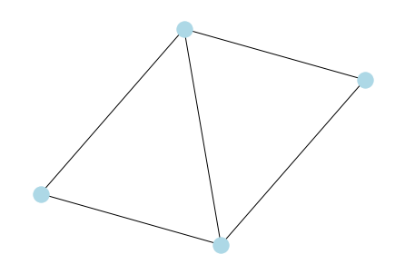
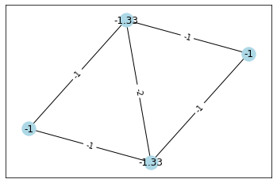

# PyGraphCurvature
Python library for calculating graph curvature. 
Given a binary adjacency matrix or a simple Networkx Graph, the curvature at the nodes 
or edges can be calculated. Specifically, we support the Forman-Ricci curvature, 
the Augmented Forman-Ricci curvature, and Lin-Lu-Yau Ricci curvature. 

### Example 

We will calculate the Forman curvatures of the above graph as follows:

    import networkx as nx
    import numpy as np
    from graph_curvature import forman_curvature
    G = nx.Graph(np.array([[0,1,1,1],
    [1,0,1,1],
    [1,1,0,0],
    [1,1,0,0]]))
    fcurvature_edge, fcurvature_node = forman_curvature(G)
    print(fcurvature_edge)
    print(fcurvature_node)

Output:

    [[nan -2. -1. -1.]
     [-2. nan -1. -1.]
     [-1. -1. nan nan]
     [-1. -1. nan nan]]
              
    [-1.33 -1.33 -1. -1. ]

First, the edge curvature is contained in the matrix where the index is the node. 
So the curvature of edge (1,2) is -1.  
Second, the node curvature is contained in the vector where the index is the node. 

Here we plot the graph with the curvatures shown.

Similarly, for Augmented Forman-Ricci curvature and Lin-Lu-Yau Ricci curvature call

	fcurvature_edge, fcurvature_node = forman_aug_curvature(G)
    
or 
    
	fcurvature_edge, fcurvature_node = lly_curvature(G)

For more examples, see the example [notebook](https://github.com/michrawson/PyGraphCurvature/blob/master/examples/example.ipynb).

### Reading on Ricci curvature
- [Wikipedia](https://en.wikipedia.org/wiki/Ricci_curvature)
- Forman. “Bochner’s method for cell complexes and combinatorial Ricci curvature”. In: Discrete & 
Computational Geometry 29 (2003), pp. 323–374
- Y. Lin, L. Lu, and S. T. Yau. “Ricci curvature of graphs”. In: Tohoku Math. J. 63 (2011), pp. 605–627
- RP Sreejith et al. “Forman curvature for complex networks”. In: Journal of Statistical Mechanics: 
Theory and Experiment 2016.6 (2016)

### Installation

The following Python packages are required:

- numpy>=1.24
- networkx>=3.1
- POT>=0.9
- matplotlib>=3.7

Install with [pip](https://pypi.org/) or your package manager of choice.

Next, clone or download this git repository. 
Add the directory to Python's path 

    import sys
    sys.path.insert(0, '/path/to/code/directory')

And import the library

	from graph_curvature import lly_curvature, forman_curvature, forman_aug_curvature  
    
### Developers/Authors (alphabetically):
[Marshall Rawson](https://github.com/MarshallRawson), Michael Rawson, [Zhaiming Shen](https://sites.google.com/view/zhaiming-shen/home), [Murong Xu](https://www.researchgate.net/profile/Murong-Xu)
